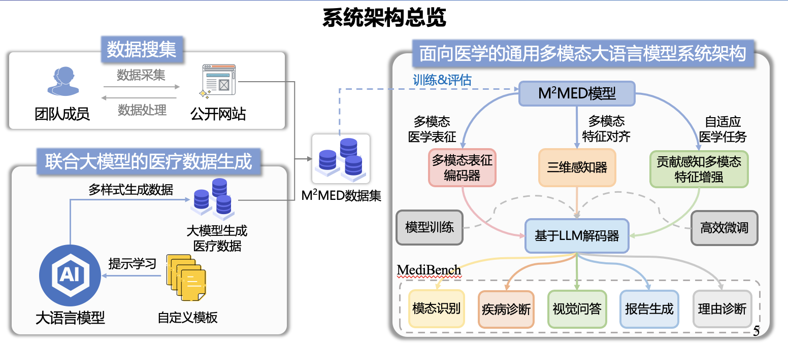
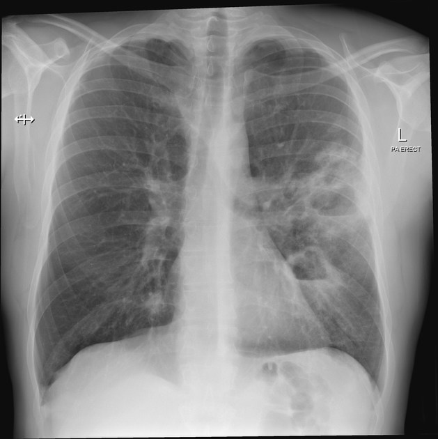
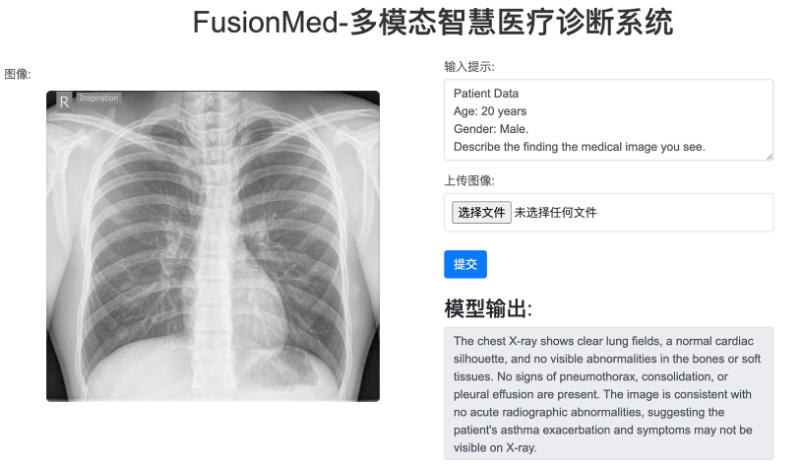
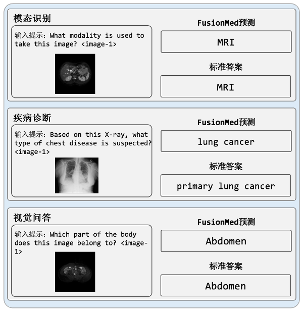
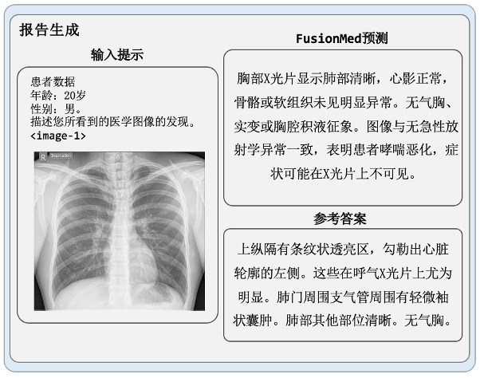
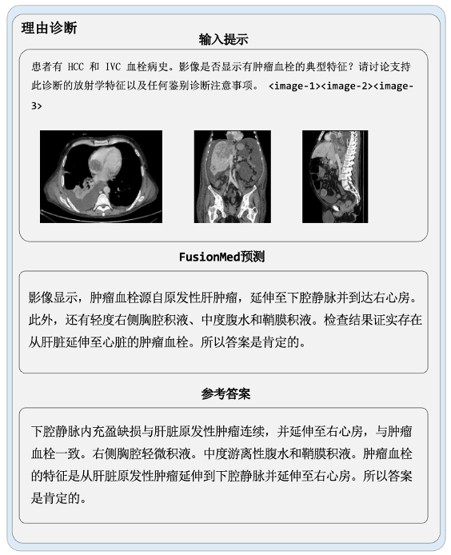

# FusionMed：基于多模态大语言模型的智慧医疗诊断系统
The official code for the 6th "Huawei Cup" China Postgraduate Artificial Intelligence Innovation Competition National Second Prize（第六届中国研究生人工智能创新大赛全国二等奖作品）

[FusionMed checkpoint](https://pan.xunlei.com/s/VOEWWw-hPSWx_-SK6OAy4gQtA1?pwd=dxq2#)

In this project, our overall goal of this project is to develop a multi-modal intelligent medical diagnosis system, FusionMed, which uses advanced artificial intelligence and deep learning technology to realize the comprehensive analysis and intelligent diagnosis of medical 2D and 3D images, texts and other data, and assist doctors in making medical decisions.



## Quick Start:

For quick start, you can check the `WebDemo/` path.   
We demonstrate a simple diagnosis case here to show how to inference with our model.   
Feel free to modify it as you want.

- S1. Download [Model checkpoint](https://pan.xunlei.com/s/VOEWWw-hPSWx_-SK6OAy4gQtA1?pwd=dxq2#) (No need for decompressing).
- S2. Decompress the original zip file, you can get a  `pytorch_model.bin`.
- S3. put `pytorch_model.bin` under path `WebDemo/` and change the path to load the model checkpoint.
- S4. python `app.py` and you can get a conversation as:   

    > Input:  Can you identify any visible signs of Cardiomegaly in the image?    
    > Output: yes 

## Pre-train:
For re-training a model on our dataset or large-scale testing our pre-train model, you can check ```src```.

Simply, ```train.py``` for training and ```test.py``` for testing.

* Check the [FusionMed_data_csv](https://huggingface.co/datasets/AndrewKing/FusionMed_data) to get how different datasets are processed and download them into `src/Dataset/data_csv` 
* Modify the path as you disire, and check ```src/train.py``` to pre-train or ```src/train.py``` to test.

## Case Study:

Some cases produced by our final model:







## Dataset-Links:
Datasets downloading URL:

| Dataset Name | Link | Access |
|--------------|------|--------|
| PMC-Figures| https://pan.baidu.com/s/1Src_rhXsaOFp8zJ_3zMFsQ?pwd=p3ne | Open Access |
| PMC-Inline | https://huggingface.co/datasets/chaoyi-wu/PMC-Inline | Open Access |
| PMC-CaseReport | [Original version](https://huggingface.co/datasets/chaoyi-wu/PMC-CaseReport_original), [Filtered version](https://huggingface.co/datasets/chaoyi-wu/PMC-CaseReport) | Open Access |
| VinDr-Mammo | https://www.physionet.org/content/vindr-mammo/1.0.0/ | Credentialed Access |
| VinDr-SpineXR | https://www.physionet.org/content/vindr-spinexr/1.0.0/ | Credentialed Access |
| VinDr-PCXR | https://physionet.org/content/vindr-pcxr/1.0.0/ | Credentialed Access |
| PMC-OA | https://huggingface.co/datasets/axiong/pmc_oa_beta | Open Access |
| PMC-VQA | https://huggingface.co/datasets/xmcmic/PMC-VQA | Open Access |
| VQA-RAD | https://osf.io/89kps/| Open Access |
| SLAKE | https://www.med-vqa.com/slake/ | Open Access |
| MIMIC-CXR | https://physionet.org/content/mimic-cxr/2.0.0 | Credentialed Access |
| VinDr-CXR | https://physionet.org/content/vindr-cxr/1.0.0/ | Credentialed Access |
| NIH ChestXray14 | https://nihcc.app.box.com/v/ChestXray-NIHCC/folder/36938765345 | Open Access |
| CheXpert | https://aimi.stanford.edu/chexpert-chest-x-rays | Open Access |
| Covid-CXR2 | https://www.kaggle.com/datasets/andyczhao/covidx-cxr2 | Open Access |
| NLM-TB | [Montgomery](https://openi.nlm.nih.gov/imgs/collections/NLM-MontgomeryCXRSet.zip), [ChinaSet](https://openi.nlm.nih.gov/imgs/collections/ChinaSet_AllFiles.zip) | Open Access |
| Object-CXR | https://web.archive.org/web/20201127235812/https://jfhealthcare.github.io/object-CXR/ | Open Access |
| OpenI | https://www.kaggle.com/datasets/raddar/chest-xrays-indiana-university | Open Access |
| RSNA| https://www.rsna.org/education/ai-resources-and-training/ai-image-challenge/rsna-pneumonia-detection-challenge-2018| Open Access |
| SIIM-ACR | https://www.kaggle.com/datasets/jesperdramsch/siim-acr-pneumothorax-segmentation-data| Open Access |

The split of each dataset can be found in https://huggingface.co/datasets/chaoyi-wu/RadFM_data_csv you just need to download the image part from each datasets.

## Dataset Codes and Files Linking:
Check the following table to see how to process each dataset and how each file in https://huggingface.co/datasets/chaoyi-wu/RadFM_data_csv is linked to each dataset:

| Dataset Name | Process Dataset Code | Related Filename |
|--------------|------|--------|
| Rad3D-series | [jpg2nii Process Code](https://github.com/chaoyi-wu/RadFM/blob/main/src/Dataset/dataset/jpg2nii_data_convert.py), [nii2npy Process Code](https://github.com/chaoyi-wu/RadFM/blob/main/src/Dataset/dataset/nii2npy_for_radiopaedio.py), [Final Datset to Read npy and Related Texts](https://github.com/chaoyi-wu/RadFM/blob/main/src/Dataset/dataset/radiopaedia.py) | radiology_article_npy_train/test.json  |
| MPx-series | [MedPix Dataset](https://github.com/chaoyi-wu/RadFM/blob/main/src/Dataset/dataset/MedPix_dataset.py) | MedPix_muli_train/test.csv, MedPix_single_train/test.csv|
| VinDr-PCXR | [Diagnosis Open Format Dataset](https://github.com/chaoyi-wu/RadFM/blob/main/src/Dataset/dataset/chestxray.py), [Diagnosis Close (yes/no) Format Dataset](https://github.com/chaoyi-wu/RadFM/blob/main/src/Dataset/dataset/binary.py) | pcxr_balance_train/test.csv |
| PMC-VQA | [vqa Dataset](https://github.com/chaoyi-wu/RadFM/blob/main/src/Dataset/dataset/vqa.py) | pmcvaq_train/test.csv|
| VQA-RAD | [vqa Dataset](https://github.com/chaoyi-wu/RadFM/blob/main/src/Dataset/dataset/vqa.py)| vqarad_train/test.csv |
| SLAKE | [vqa Dataset](https://github.com/chaoyi-wu/RadFM/blob/main/src/Dataset/dataset/vqa.py) | slakevqa_train/test.csv |
| MIMIC-CXR | [CXR Open Captioning Dataset](https://github.com/chaoyi-wu/RadFM/blob/main/src/Dataset/dataset/chestxray.py) | mimic_caption_train/test.csv |
| VinDr-CXR | [Diagnosis Open Format Dataset](https://github.com/chaoyi-wu/RadFM/blob/main/src/Dataset/dataset/chestxray.py), [Diagnosis Close (yes/no) Format Dataset](https://github.com/chaoyi-wu/RadFM/blob/main/src/Dataset/dataset/binary.py) | chestxray_balance_train_new.csv,  chestxray_balance_test.csv|
| PMC-Inline | [Paper-inline Dataset](https://github.com/chaoyi-wu/RadFM/blob/main/src/Dataset/dataset/paper_inline.py) | paper_train.csv (This dataset is not used for evaluation) |
| PMC-CaseReport | [Case-report Dataset](https://github.com/chaoyi-wu/RadFM/blob/main/src/Dataset/dataset/case_report.py) | filtered_case_report_train/test.csv |
| VinDr-Mammo | [Diagnosis Open Format Dataset](https://github.com/chaoyi-wu/RadFM/blob/main/src/Dataset/dataset/chestxray.py), [Diagnosis Close (yes/no) Format Dataset](https://github.com/chaoyi-wu/RadFM/blob/main/src/Dataset/dataset/binary.py) | mammo_balance_train/test.csv |
| VinDr-SpineXR | [Diagnosis Open Format Dataset](https://github.com/chaoyi-wu/RadFM/blob/main/src/Dataset/dataset/chestxray.py), [Diagnosis Close (yes/no) Format Dataset](https://github.com/chaoyi-wu/RadFM/blob/main/src/Dataset/dataset/binary.py) | spinexr_balance_train/test.csv |
| NIH ChestXray14 | [Diagnosis Open Format Dataset](https://github.com/chaoyi-wu/RadFM/blob/main/src/Dataset/dataset/chestxray.py), [Diagnosis Close (yes/no) Format Dataset](https://github.com/chaoyi-wu/RadFM/blob/main/src/Dataset/dataset/binary.py) | chestxray_balance_train_new.csv,  chestxray_balance_test.csv |
| CheXpert | [Diagnosis Open Format Dataset](https://github.com/chaoyi-wu/RadFM/blob/main/src/Dataset/dataset/chestxray.py), [Diagnosis Close (yes/no) Format Dataset](https://github.com/chaoyi-wu/RadFM/blob/main/src/Dataset/dataset/binary.py) | chestxray_balance_train_new.csv,  chestxray_balance_test.csv |
| Covid-CXR2 | [Diagnosis Open Format Dataset](https://github.com/chaoyi-wu/RadFM/blob/main/src/Dataset/dataset/chestxray.py), [Diagnosis Close (yes/no) Format Dataset](https://github.com/chaoyi-wu/RadFM/blob/main/src/Dataset/dataset/binary.py) | chestxray_balance_train_new.csv,  chestxray_balance_test.csv |
| NLM-TB | [Diagnosis Open Format Dataset](https://github.com/chaoyi-wu/RadFM/blob/main/src/Dataset/dataset/chestxray.py), [Diagnosis Close (yes/no) Format Dataset](https://github.com/chaoyi-wu/RadFM/blob/main/src/Dataset/dataset/binary.py) | chestxray_balance_train_new.csv,  chestxray_balance_test.csv |
| Object-CXR | [Diagnosis Open Format Dataset](https://github.com/chaoyi-wu/RadFM/blob/main/src/Dataset/dataset/chestxray.py), [Diagnosis Close (yes/no) Format Dataset](https://github.com/chaoyi-wu/RadFM/blob/main/src/Dataset/dataset/binary.py) | chestxray_balance_train_new.csv,  chestxray_balance_test.csv |
| OpenI | [Diagnosis Open Format Dataset](https://github.com/chaoyi-wu/RadFM/blob/main/src/Dataset/dataset/chestxray.py), [Diagnosis Close (yes/no) Format Dataset](https://github.com/chaoyi-wu/RadFM/blob/main/src/Dataset/dataset/binary.py) | chestxray_balance_train_new.csv,  chestxray_balance_test.csv |
| RSNA| [Diagnosis Open Format Dataset](https://github.com/chaoyi-wu/RadFM/blob/main/src/Dataset/dataset/chestxray.py), [Diagnosis Close (yes/no) Format Dataset](https://github.com/chaoyi-wu/RadFM/blob/main/src/Dataset/dataset/binary.py)| chestxray_balance_train_new.csv,  chestxray_balance_test.csv |
| SIIM-ACR | [Diagnosis Open Format Dataset](https://github.com/chaoyi-wu/RadFM/blob/main/src/Dataset/dataset/chestxray.py), [Diagnosis Close (yes/no) Format Dataset](https://github.com/chaoyi-wu/RadFM/blob/main/src/Dataset/dataset/binary.py) | chestxray_balance_train_new.csv,  chestxray_balance_test.csv|


